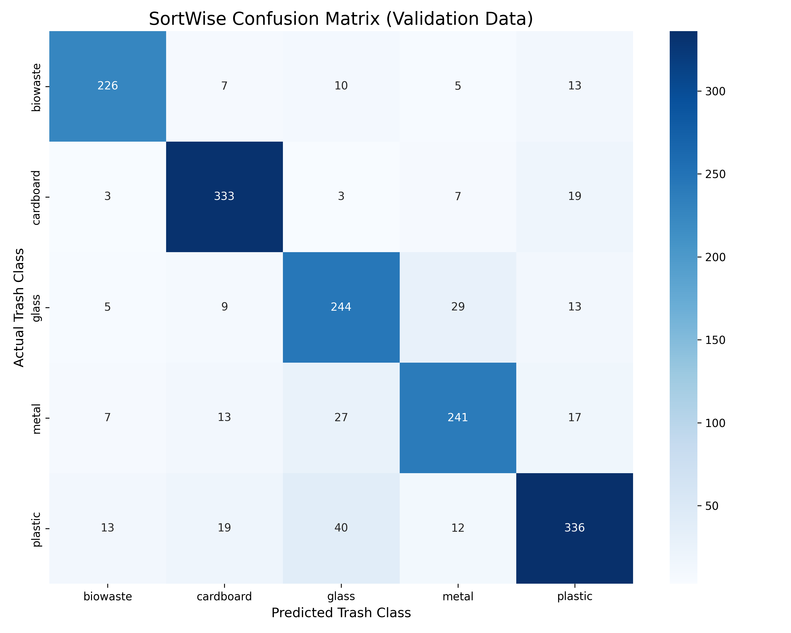

# ♻️ SortWise: Finnish Waste Classification AI

**An AI-powered computer vision system designed to help residents in Finland sort household waste correctly according to HSY/local guidelines.**

  

## 🇫🇮 The Problem
New residents and even locals in Finland often struggle with complex recycling rules (e.g., distinguishing *Kartonki* form *Paperi*, or knowing what counts as *Biojäte*). Incorrect sorting contaminates recycling batches.

## 💡 The Solution
SortWise uses a **MobileNetV2** Convolutional Neural Network (Transfer Learning) to classify waste images into 6 categories standard in Finnish waste management:
* **Biowaste (Biojäte)**
* **Plastic (Muovi)**
* **Cardboard (Kartonki)**
* **Glass (Lasi)**
* **Metal (Metalli)**
* **Mixed Waste (Sekajäte)**

## 🛠️ Technical Implementation
* **Data Pipeline:** Custom ETL scripts (`src/preprocess.py`) to standardize input images to 224x224 RGB.
* **Handling Imbalance:** Implemented automated undersampling (`src/balance_data.py`) to manage class disparity (e.g., balancing 13k Bio images vs 400 Metal images).
* **Model:** Fine-tuned MobileNetV2 with custom head (GlobalAveragePooling + Dropout) for efficiency on consumer hardware.
* **Data Augmentation:** Used `ImageDataGenerator` (rotation, zoom, shear) to improve generalization on small classes like Mixed Waste.


## 📅 Dev Log: December 16, 2025
*Today marked a major milestone: moving from data processing to a fully trained, inference-ready AI model.*

### 🚧 Challenges Faced
We encountered significant environment issues involving Python 3.14 compatibility with TensorFlow. We resolved this by building a dedicated Anaconda environment (`waste_sorter`) running Python 3.10, ensuring a stable training pipeline.

### 🧪 Real-World Testing & Insights
After training the MobileNetV2 model (achieving **88% training accuracy** and **80% validation accuracy**), we conducted three specific "stress tests" on real-world images to evaluate the model's logic:

1.  **The "Valio Milk" Test (Fail):**
    * *Input:* A red Valio milk carton with a picture of a cow.
    * *Prediction:* **Biowaste** (43% confidence).
    * *Insight:* The model likely associated the cow (animal/organic) and the color red with biological waste. This highlights the need for **Finnish-specific fine-tuning** (local branding awareness).

2.  **The "Intact Coke Bottle" Test (Fail):**
    * *Input:* A clear, smooth Coca-Cola bottle.
    * *Prediction:* **Glass** (79% confidence).
    * *Insight:* The model struggled to distinguish clear plastic from glass based on transparency and specularity alone.

3.  **The "Crushed Bottle" Test (SUCCESS ✅):**
    * *Input:* A crushed, crinkled water bottle.
    * *Prediction:* **Plastic** (73.8% confidence).
    * *Insight:* **Success!** The model correctly identified plastic when the object was deformed. Since glass shatters and does not crinkle, the AI successfully used the object's physical properties/geometry to make the correct classification.

## 📅 Dev Log: December 30, 2025
*Milestone: Phase 2 Fine-Tuning Complete & Batch Testing.*

### 🚀 Progress
We successfully fine-tuned the top layers of the model, achieving a **Training Accuracy of 95.3%** and **Validation Accuracy of ~81.6%**. The model is now capable of running batch predictions on folders of mixed images.

### 🧪 Latest Stress Test Results
We ran a "Blind Batch Test" on random internet images. The results revealed clear strengths and biases:

#### ✅ The Wins
1.  **Biowaste Mastery:** The model is incredibly confident (>99%) with organic matter like banana peels, compost, and vegetables.
2.  **Texture Recognition:** Successfully identified an **IKEA Box** as *Cardboard* (86%) despite the complex logos, proving it is learning feature shapes.

#### ⚠️ The "Background Bias" Discovery
The model revealed a critical flaw in how it perceives context:
* **The "Dirty Bottle" Error:**
    * *Input:* A plastic bottle sitting on a pile of dirt/trash.
    * *Prediction:* **Biowaste** (99% confidence).
    * *Insight:* The model ignored the bottle and classified the **background** (dirt) as compost. This suggests the training data for "Plastic" was too clean, while "Biowaste" data was mostly messy/brown.

* **The "Color Trap":**
    * *Input:* A plain brown cardboard box.
    * *Prediction:* **Biowaste** (62% confidence).
    * *Insight:* Without distinct texture cues (like corrugation), the model confuses the color **brown** with potato peels or leaves.

### 🔮 Next Steps
* **Data Augmentation:** Implement rotation and zooming to force the model to focus on object shape rather than background color.
* **Targeted Data Collection:** Add more images of "Plastic on dirt" and "Clean Cardboard" to break the current biases.

## 📅 Dev Log: January 6, 2026
*Milestone: Visual Interface & Critical Logic Fixes.*

### 🚀 Major Feature: Web Interface (GUI)
Moved away from command-line scripts and built a **Streamlit Web App** (`src/app.py`).
* **Why:** To visualize model confidence scores and debug "borderline" predictions in real-time.
* **Feature:** Users can now drag-and-drop images and see a breakdown of probabilities (e.g., "55% Plastic, 45% Paper").

### 🐛 Bug Fix: The "Plastic is Paper" Error
**The Problem:** The model was consistently labeling plastic bottles as "Paper" in the CLI, despite high confidence.
**The Root Cause:** A "silent shift" in class mapping.
* The training data contained **5 classes** (Paper folder was deleted previously).
* The prediction code expected **6 classes** (including Paper).
* **Result:** The model predicted Index 4 (Plastic), but the code mapped Index 4 to "Paper".
**The Fix:** Updated `CLASS_NAMES` in `app.py` to dynamically match the actual 5-class training structure.

### 📉 Current Challenge: The "Brown Box" Bias
**Issue:** The model frequently misclassifies **Cardboard** as **Biowaste** (~60% confidence).
**Analysis:** The model is over-relying on **color** (Brown) rather than **shape** (Square edges). Since most biowaste images are brownish (dirt/compost), the model assumes "Brown = Bio".

### 🔮 Next Steps
* **Advanced Augmentation:** Investigate "Color Jitter" or Edge Detection to force the model to focus on geometry over color.
* **UI Polish:** Add a "Feedback Loop" button so users can correct the AI when it makes a mistake.
---

## 📅 Dev Log: January 20, 2026
*Milestone: Solved "Color Bias" & "Texture Traps" via Advanced Augmentation.*

### 🚀 Critical Fix: The "Brown Box Bias" & "Blue Milk Error"
We discovered the model was overfitting to **color** rather than shape:
* **The Error:** It classified brown cardboard and blue milk cartons as **Biowaste**.
* **The Why:** It learned simple rules: "Brown = Compost" and "Blue/Context = Trash".
* **The Fix:** We implemented a **Color Jitter Pipeline** using `Albumentations` (shifting Hue/Saturation/Brightness).
* **The Result:** The model now correctly identifies **Blue Valio Cartons** and **Brown Boxes** as Cardboard because it can no longer rely on color—it is forced to look at geometry.

### 🧩 Critical Fix: The "Texture Trap" (Multiple Bottles)
We found a new bug where **multiple plastic bottles** were classified as **Biowaste**.
* **The Error:** A pile of clean bottles creates visual chaos/crinkles. The model interpreted "Chaos" as "Compost."
* **The Fix:** We implemented **Mosaic Augmentation** (`src/augment_finnish.py`).
    * This script stitches 4 random plastic images into a 2x2 grid.
    * It teaches the model that "Messy Grids" can still be Plastic.
* **The Result:** The model now recognizes "clutter" as valid recyclable material, not just organic waste.

### 🛠️ Technical Improvements
* **Smart Zoom (Center Crop):** Updated `src/predict.py` and `src/app.py` to automatically zoom into the center of images, removing background noise (dirt/grass) that confused the AI.
* **Flexible Inference:** The CLI script now accepts both single file paths and entire folders, and automatically handles Windows path quotation marks.
* **Visual Confidence:** The Streamlit app now displays a full probability bar chart, visualizing exactly when the model is "confused" (e.g., 50% Glass vs 50% Plastic).


### 🚀 Recent Engineering Updates (Phase 2 & 3)
We significantly improved the model's accuracy and robustness against the "Biowaste Bias" (where the model incorrectly classified everything as biowaste).

1. Automated Data Pipeline

- Web Scraper Integration: Built a custom scraper (src/scrape_data.py) using duckduckgo_search to gather real-world images of Finnish waste (e.g., "Atria lihapakkaus", "Valio maitotölkki").

- Auto-Janitor Script: Implemented an AI-based cleaning script (src/auto_clean.py) that uses Face Detection and Blur/Texture Analysis to automatically remove cartoons, stock photos with faces, and duplicates from the dataset.

2. Advanced Data Augmentation

- Hard Negative Mining: Identified specific failure cases (e.g., clear plastic bottles looking like glass) and used active learning to target them. We multiplied these "hard" examples by 50x in the training set to force the model to learn.

- Mosaic Augmentation: Created "Mosaic Piles" (stitching 4 images together) to teach the model that clutter does not always equal biowaste.

- Color Jittering: Applied heavy hue/saturation shifts to prevent the model from memorizing specific colors (e.g., "Orange always equals Biowaste").

3. Robust Inference Engine

- Test-Time Augmentation (TTA): The prediction script (src/predict.py) no longer relies on a single snapshot. It now creates 3 variations of the input image (Standard, Zoomed-Crop, Horizontal Flip) and averages the predictions. This boosted accuracy on "weird" internet images from ~30% confidence to consistent correct classifications.

- Smart Confidence Logic: Moved away from raw confidence thresholds. The system now calculates the Winning Margin to distinguish between "Low Confidence but Correct" and "Actually Confused."

4. Results

- Validation Accuracy: Reached 86.61%.

- Real-World Performance: Successfully fixed the confusion between Shiny Plastic vs. Metal and Clear Plastic vs. Glass.

## 📅 Dev Log: February 19, 2026
*Milestone: Deep Learning Pipeline Overhaul & Webcam Integration.*

Today, we completely rewrote the internal logic of our training and inference scripts to solve the "Domain Shift" problem (where the model memorizes backgrounds instead of the trash itself). We also unlocked real-time webcam testing.

### 🎥 The Webcam Milestone (`src/app.py`)
Up until now, we relied on static image uploads. Today, we fully integrated Streamlit's `st.camera_input` into our inference pipeline. The app now takes a live photo, applies our normalization math, runs it through our multi-crop AI, and outputs a prediction in seconds. This brings the project to its final intended form: a real-world, interactive tool.

### 🧠 Logic Overhaul: `train_model.py`
We changed how the model learns to force it to look at textures instead of backgrounds:
* **Label Encoding Shift:** Changed `label_mode='int'` to `'categorical'`. This one-hot encoding was required to unlock advanced loss and augmentation math.
* **MixUp Augmentation:** Added a custom `mixup_batch()` function. Instead of feeding the model one image, it blends two random images and their labels together (e.g., 60% plastic, 40% cardboard).  This completely destroys the background context, forcing the AI to learn raw material textures. 
* **Focal Loss:** Replaced standard crossentropy with `CategoricalFocalCrossentropy`. Standard loss treats all mistakes equally; Focal Loss mathematically ignores easy classes (like Cardboard) and aggressively penalizes the model for missing edge cases (like Clear Plastic).
* **Top-2 Accuracy Metric:** Added `TopKCategoricalAccuracy(k=2)`. Since trash can be highly ambiguous, we now track if the correct answer was at least in the model's top two guesses.

### 🔬 Logic Overhaul: `predict.py`
We rebuilt the inference script so the AI doesn't just "glance" at an image; it scans it thoroughly:
* **6-View Test-Time Augmentation (TTA):** Upgraded our 3-crop TTA to a 6-crop TTA.  The script now uses NumPy slicing to generate standard, flipped, center-crop, tight-center-crop, left-crop, and right-crop views. It averages the predictions across all 6 views to easily spot off-center objects.
* **Entropy & Margin Diagnostics:** Added complex uncertainty math. The script now calculates **Margin** (Top 1 minus Top 2 probability) and **Entropy** (overall chaos of the prediction). This allows the system to clearly distinguish between *"I am confident, but the background is messy"* versus *"I have absolutely no idea what this is."*

### 📊 Model Evaluation: The Confusion Matrix
To mathematically verify our model's performance and identify remaining edge cases, we generated a Confusion Matrix on our validation dataset (comprising 20% of our total scraped data).



**Key Takeaways from the Matrix:**
* **The Victory Line:** The strong dark blue diagonal proves the model's 83% accuracy is well-distributed across all 5 classes. It is no longer blindly guessing or suffering from the earlier "Biowaste Bias."
* **Cardboard & Plastic Mastery:** The model is highly confident and accurate with Cardboard (333 correct) and Plastic (336 correct).
* **Known Edge Cases:** The light blue squares reveal exactly where the AI struggles, giving us a roadmap for Phase 4. It confused **Plastic with Glass** 40 times (due to clear water bottles looking identical to clear glass) and **Metal with Glass** 27 times (due to shiny glare and reflections).

## 📂 Project Structure

```text
finnish-waste-sorter/
├── app/                # Application specific resources
├── data/               # Raw and Processed data (GitIgnored)
├── models/             # Trained .h5 models
├── src/                # Source code
│   ├── app.py          # Streamlit Web Interface (Main Entry Point)
│   ├── augment_finnish.py # Specific augmentation for Finnish brands
│   ├── balance_data.py # Class balancing logic
|   ├── auto_clean.py   # Cleans the data 
|   ├── scrape.py       # scrape the data from the web
│   ├── check_data.py   # Utility to verify dataset integrity
│   ├── predict.py      # CLI Batch inference script
│   ├── preprocess.py   # Image resizing and cleaning
│   ├── reset_data.py   # Utility to reset processed data
│   └── train_model.py  # MobileNetV2 training loop
|   └── train_model_old.py # previous train script
├── test_dump/          # Local testing images (GitIgnored)
├── .gitignore          # Files to exclude from Git
├── requirements.txt    # Project dependencies
└── README.md           # Project documentation